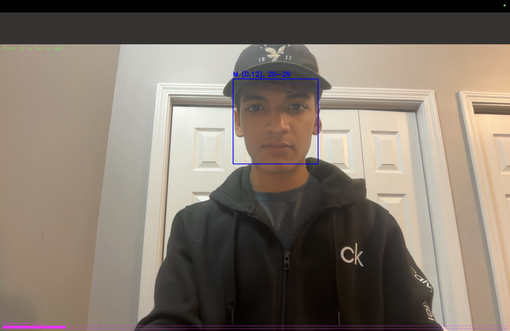

# Gender & Age Detection

Real-time CNN model that detects faces, predicts gender (binary) and age brackets (multi-class), and overlays results on webcam feeds.

---

## Setup

\`\`\`bash
git clone git@github.com:PraneethReddy03/gender-age-detection.git
cd gender-age-detection
python3 -m venv venv
source venv/bin/activate
pip install -r requirements.txt
\`\`\`

## ️ Data Preparation

1. Download UTKFace or Adience dataset into \`data/raw/\`.  
2. Run face cropping:
   \`\`\`bash
   python src/detect_and_crop.py --input data/raw --output data/processed
   \`\`\`

##  Training

\`\`\`bash
python src/train.py --data_dir data/processed --epochs 30 --batch_size 32
\`\`\`

*(Implement dataset loading in \`train.py\` before running.)*

##  Inference

\`\`\`bash
python src/infer.py --model outputs/models/best.h5
\`\`\`

## Repo Structure

gender-age-detection/  
• data/  
  • raw/  
  • processed/  
• outputs/  
  • models/  
  • figures/  
• notebooks/  
• src/  
  • detect_and_crop.py  
  • train.py  
  • infer.py  
• .gitignore  
• README.md  
• requirements.txt  
• LICENSE  
• venv/  

## Demo

Below is a snapshot of the real-time demo:

## License

This project is licensed under the MIT License.
